# Gemma4 Parser Changes vs `ai-dynamo/dynamo`

**Reference:** Aligned with [Tushar-ml/vllm PR #5](https://github.com/Tushar-ml/vllm/pull/5) snapshot-based parsing and prefix-diff content cleaning.

**Compared:** `feat/gemma-4-hybrid-memoery` (fork) vs `origin/main` (`ai-dynamo/dynamo`)

---

## Executive summary

Upstream Dynamo had a **~530-line incremental state machine** in `gemma4_parser.rs` with logic duplicated across reasoning, tool parsing, and streaming paths. This fork centralizes Gemma4 protocol handling in a new **`format.rs` module** (Rust + Python mirror), rewrites the reasoning parser as a thin snapshot wrapper, adds **prefix-diff streaming cleaners**, and extends content sanitization for `enable_thinking=false` and post-tool leaks.

| Area | Upstream (`ai-dynamo/dynamo`) | This fork |
|------|------------------------------|-----------|
| Shared format helpers | None (`format.rs` did not exist) | New `lib/parsers/.../gemma4/format.rs` + `gemma4_format.py` |
| Reasoning batch | Multi-span iterative loop | Single `extract_reasoning_non_streaming()` |
| Reasoning stream | Per-chunk state machine + `overlap()` | Accumulate → `strip_trailing_incomplete_token` → snapshot diff |
| Content cleaning | Per-delta / partial helpers | Prefix-diff on cleaned cumulative text |
| `enable_thinking=false` | No dedicated sanitizer on upstream `main` | `StreamingContentCleaner` in preprocessor |
| Tool jail pre-tool content | Raw prefix passthrough | Gemma4 `StreamingContentCleaner` in `jail.rs` |
| Orphan `<\|"\|>`, `<tool_call\|>` leaks | Not stripped from visible content | `strip_leaked_tool_grammar()` |
| Chat template (`enable_thinking=false`) | Injects empty `<\|channel>thought\n<channel\|>` | **Unchanged vs upstream in current diff** |

---

## 1. New shared module: `lib/parsers/src/tool_calling/gemma4/format.rs`

**Upstream:** No equivalent file. Helpers were inlined in `gemma4_parser.rs` and scattered in `parser.rs`.

**New file (~589 lines)** exports:

| Symbol | Purpose |
|--------|---------|
| `CHANNEL_START`, `CHANNEL_END`, `THOUGHT_PREFIX` | Shared constants |
| `ReasoningSnapshot` | `{ reasoning, content }` snapshot for batch/stream |
| `extract_reasoning_non_streaming()` | SGLang/vLLM-aligned batch split |
| `diff_reasoning_streaming_snapshots()` | Delta between two snapshots |
| `strip_trailing_incomplete_token()` | Streaming-safe tail trim (proper prefixes only) |
| `StreamingContentCleaner` | Stateful prefix-diff for pre-tool visible content |
| `strip_leaked_empty_thinking()` | Channel + thought leak suppression |
| `strip_leaked_tool_grammar()` | Strips orphan `<\|"\|>` and `<tool_call\|>` |
| `strip_thought_shard_echoes()` | Glued `thought` shard removal |
| `strip_tool_call_suffix()` | Truncate at first tool markup |
| `finalize_client_content()` | `strip_leaked` → `strip_tool_call_suffix` |
| `clean_visible_prefix()` | Pre-tool prose cleaning in batch parser |
| `extract_tool_handoff_text()` | Reasoning→tool same-chunk handoff |

### `strip_trailing_incomplete_token`

- **Upstream:** `overlap()` helper inside `gemma4_parser.rs` for partial `<|channel>` / `<channel|>` only.
- **Fork:** Token-derived prefix table from control tokens (`<|channel>`, `<channel|>`, `<|tool_call>`, `<tool_call|>`, `<|"|>`, etc.). Iterates `1..tok.len()` so **complete** tokens (e.g. `<|"|>`) are never stripped.

### `extract_reasoning_non_streaming` semantics (intentional breaking changes)

| Case | Upstream Dynamo | Fork (vLLM PR #5) |
|------|-----------------|-------------------|
| No `<\|channel>` | Pass-through (with some finalize behavior) | Full string as `content`, no reasoning |
| Dangling `<channel\|>` without start | **Recovered as reasoning** (`some thinking<channel\|>answer` → reasoning=`some thinking`) | **Stays in content** (`normal<channel\|>answer` passes through) |
| Multiple `<\|channel>…<channel\|>` spans | **Concatenated** into `reasoning_text` | **First span only**; later spans remain in `content` |
| Open channel, no close | Mixed behavior | `reasoning` only, `content=None` (pre-channel text held) |
| Open channel + `<\|tool_call>` before close | Less consistent | Tool handoff: reasoning to tool idx, markup preserved in `content` |
| Channel closes with empty post-marker | Could emit early | `content=None` until more text arrives |

### `strip_leaked_empty_thinking` extensions

**Upstream:** Only triggered when channel markers or `thought` present; stripped channels and thought shards.

**Fork additions:**

- `may_contain_gemma4_control_leak()` — also triggers on `<|"|>`, `<tool_call|>`, `<|tool_call>`
- `strip_leaked_tool_grammar()` — removes orphan `<|"|>` and `<tool_call|>` (not `<|tool_call>`, preserved for suffix strip)
- Fixes leakage cases such as:
  - `<|"|>Great news!...` → `Great news!...`
  - `thought<tool_call|>` → empty
  - `<tool_call|>` → empty

### Dynamo-only extras retained

- Composite/orphan patterns: `thought\n<|channel>thought\n<channel|>`, `thought\n<channel|>`
- `strip_thought_shard_echoes` for streaming cut artifacts (`thoughtthought`, `thought`×11 + `tho`, etc.)

---

## 2. Reasoning parser rewrite: `lib/parsers/src/reasoning/gemma4_parser.rs`

**Upstream:** ~530 lines, fields: `buffer`, `in_reasoning`, `prefix_resolved`, `reasoning_accum`, custom `overlap()`.

**Fork:** ~380 lines, fields: `cumulative_text`, `prev_cumulative_text`, `last_safe_text`, `emitted_content`.

### Batch (`detect_and_parse_reasoning`)

```rust
// Fork: delegates to shared helper
extract_reasoning_non_streaming(text) → ParserResult
```

### Stream (`parse_reasoning_streaming_incremental`)

```
delta → append cumulative_text
     → safe = strip_trailing_incomplete_token(cumulative)
     → prev_snapshot, curr_snapshot = extract_reasoning_non_streaming(safe_*)
     → diff_reasoning_streaming_snapshots
     → suppress content while first channel open
     → track emitted_content to avoid duplicate pre-channel text
```

### Removed upstream behaviors

- Iterative multi-span extraction loop
- Dangling `<channel|>` recovery into `reasoning_content`
- `overlap()`-based partial marker buffering inside reasoning parser (moved to `format.rs`)

### Test expectation changes

| Test | Upstream expectation | Fork expectation |
|------|---------------------|------------------|
| `detect_dangling_end_marker_extracts_prefix_as_reasoning` | reasoning=`some thinking` | **Replaced:** passes through as content |
| `detect_multiple_reasoning_spans` | Both spans in reasoning | **First span only** |
| New streaming snapshot tests | — | Split markers, channel-open suppression, emitted_content dedup |

---

## 3. Tool parser: `lib/parsers/src/tool_calling/gemma4/parser.rs`

**Upstream:** Inline content cleaning; less centralized.

**Fork changes:**

- Uses `clean_visible_prefix()` / `finalize_client_content()` from `format.rs` for pre-tool `normal_text`
- Batch path: `clean_visible_prefix(message[..idx].trim())` on prefix before first `<|tool_call>` (includes `strip_leaked_empty_thinking`)
- Recovery path: suppress entire message when markup present but zero calls parsed (prevents marker leak)
- Additional unit tests for paired reasoning+tool, embedded markers, truncation, etc.

**Exports** (`gemma4/mod.rs`, `tool_calling/mod.rs`):

- `StreamingContentCleaner`, `ReasoningSnapshot`, `extract_reasoning_non_streaming`, `diff_reasoning_streaming_snapshots`, `strip_trailing_incomplete_token`, `extract_tool_handoff_text`

---

## 4. LLM postprocessor: `lib/llm/src/preprocessor.rs`

**Upstream (`main`):** When `enable_thinking=false`, reasoning parser is simply **not run** — no dedicated content sanitizer.

**Fork:** New branch when `enable_thinking=false` + gemma4 parser configured:

```rust
should_sanitize_gemma4_leaked_channels → sanitize_gemma4_leaked_content_from_stream()
```

`sanitize_gemma4_leaked_content_from_stream`:

- Per-choice `previous_text` + `StreamingContentCleaner`
- Prefix-diff via `pre_tool_content_delta(previous, current, delta)`
- **Does not** run reasoning parser in suppress mode

**New integration test:** `lib/llm/tests/postprocessor_parsing_stream.rs` — split-channel chunks:

```text
["<|channel>", "thought\n", "<channel|>", "<|channel>", "Hi. ", "<|tool_call>", ...]
→ content starts with "Hi.", no channel markers
```

---

## 5. Tool jail streaming: `lib/llm/src/protocols/openai/chat_completions/jail.rs`

**Upstream:** Pre-tool visible segments emitted raw via `create_choice_stream(prefix, ...)`.

**Fork:** For `tool_call_parser` = `gemma4` / `gemma-4`:

- `ChoiceJailState` adds `visible_raw_cumulative` + `gemma4_content_cleaner`
- `visible_content_for_emission()` → `StreamingContentCleaner.pre_tool_content_delta()`
- `push_visible_emission()` used for PassThrough and Trailing emissions
- Jailed/tool-parse paths unchanged (still use batch parser `normal_text`)

---

## 6. Python frontend: `components/src/dynamo/frontend/`

### New: `gemma4_format.py` (~315 lines)

Mirror of Rust `format.rs`:

- `StreamingContentCleaner`
- `extract_reasoning_non_streaming`
- `strip_leaked_empty_thinking` + `_strip_leaked_tool_grammar`
- `strip_trailing_incomplete_token` (set-comprehension suffix table)
- `has_gemma4_tool_markup`, `strip_tool_call_suffix`

### Updated: `prepost.py`

| Behavior | Upstream | Fork |
|----------|----------|------|
| Streaming content clean | Per-delta `_clean_visible_content(delta)` | Prefix-diff `_streaming_content_delta(previous, current, delta)` when `_gemma4_tools` or `_thinking_disabled` |
| Non-streaming finish | Partial cleaning | Full-text `strip_leaked` + `strip_tool_call_suffix` |
| `_clean_visible_content` | Basic | Also applies `strip_tool_call_suffix` |

### New tests: `tests/test_gemma4_format.py`

- Thought shard echoes
- `StreamingContentCleaner` prefix-diff
- `strip_leaked_empty_thinking` channel cases

---

## 7. Parity fixtures

Updated under `tests/parity/reasoning/fixtures/gemma4/`:

**`REASONING.batch.yaml`**

- `REASONING.batch.4` — dangling end → content (not reasoning)
- `REASONING.batch.5` — open channel, no pre-channel `normal_text`
- `REASONING.batch.6.a` — first span only
- `REASONING.batch.3.b` — open channel → tool handoff

**`REASONING.stream.yaml`**

- `REASONING.stream.2.b` — first span only in stream
- `REASONING.stream.3.b` — end marker split across chunks

Many new toolcalling/parser parity YAML files also added under `tests/parity/toolcalling/fixtures/gemma4/` and `tests/parity/parser/fixtures/gemma4/`.

---

## 8. Chat template

**Planned change (vLLM PR #5 / HF `google/gemma-4-26b-a4b-it`):** Remove generation-prompt injection:

```jinja

    {{- '<|channel>thought\n<channel|>' -}}

```

**Current branch vs `origin/main`:** No diff on `examples/chat_templates/gemma4_tool.jinja` — injection **still present** in both. Removing it remains a recommended follow-up to stop the model echoing empty thought channels when thinking is disabled.

---

## 9. Architecture

```mermaid
flowchart TD
    subgraph batch [Non-streaming]
        fullText[Full model text]
        extract[extract_reasoning_non_streaming]
        finalize[finalize_client_content]
        fullText --> extract
        extract -->|reasoning| reasoningOut[reasoning_content]
        extract -->|content| finalize --> contentOut[content]
    end

    subgraph stream [Streaming]
        delta[Per-chunk delta]
        accum[Accumulate cumulative_text]
        safe[strip_trailing_incomplete_token]
        snap[extract_reasoning_non_streaming snapshot]
        diff[diff_reasoning_streaming_snapshots]
        delta --> accum --> safe --> snap --> diff
    end

    subgraph sanitize [enable_thinking=false]
        cleaner[StreamingContentCleaner prefix-diff]
        strip[strip_leaked_empty_thinking + strip_leaked_tool_grammar]
        cleaner --> strip
    end
```



---

## 10. Files touched (parser-related)

| File | Change type |
|------|-------------|
| `lib/parsers/src/tool_calling/gemma4/format.rs` | **New** |
| `lib/parsers/src/reasoning/gemma4_parser.rs` | **Rewrite** |
| `lib/parsers/src/tool_calling/gemma4/parser.rs` | **Extended** |
| `lib/parsers/src/tool_calling/gemma4/mod.rs` | Exports |
| `lib/parsers/src/tool_calling/mod.rs` | Re-exports |
| `lib/llm/src/preprocessor.rs` | Gemma4 sanitize stream |
| `lib/llm/src/protocols/openai/chat_completions/jail.rs` | Gemma4 prefix-diff in jail |
| `lib/llm/tests/postprocessor_parsing_stream.rs` | New integration test |
| `components/src/dynamo/frontend/gemma4_format.py` | **New** |
| `components/src/dynamo/frontend/prepost.py` | Prefix-diff cleaning |
| `components/src/dynamo/frontend/tests/test_gemma4_format.py` | **New** |
| `tests/parity/reasoning/fixtures/gemma4/*.yaml` | Updated expectations |
| `tests/parity/toolcalling/fixtures/gemma4/*.yaml` | Many new fixtures |
| `examples/chat_templates/gemma4_tool.jinja` | No change vs upstream |

---

## 11. Verification

```bash
cargo test -p dynamo-parsers gemma4
pytest components/src/dynamo/frontend/tests/test_gemma4_format.py
cargo test -p dynamo-llm postprocessor_parsing_stream_gemma4
# parity harness (if available):
# tests/parity/reasoning + tests/parity/toolcalling gemma4 fixtures
```

---

## 12. Remaining gaps / follow-ups

1. **Chat template** — remove empty-channel injection when `enable_thinking=false` (still in template vs upstream).
2. **Post-tool content path** — ensure all assistant turns after tool results flow through `strip_leaked_empty_thinking` (leakage suite showed `<|"|>` in `T4:post_eligibility` / `T2:post_tool`).
3. **`REASONING.batch.6.b`** — Dynamo-specific stray `<channel|>` stripping in `normal_text` (`bodyanswer` vs vLLM `body<channel|>answer`); intentional Dynamo divergence documented in fixtures.
